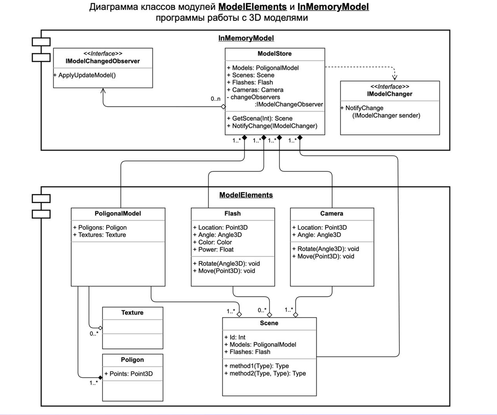

# softwareArchitecture



## Package [modelElements](https://github.com/blinktreeman/softwareArchitecture/tree/main/src/main/java/ru/bcomms/modelElements)

Помимо описанных в диаграмме классов выполнены классы 

Point3D.java:
```java
public class Point3D {
    private double x, y, z;
    ...
```
Angle3D.java:
```java
public class Angle3D {
    private double angleXAxe, angleYAxe, angleZAxe;
    ...
```
enum Color:
```java
public enum Color {
    red,
    orange,
    yellow,
    green,
    blue,
    white,
    black
}
```
Реализованы классы Polygon.java, Texture.java, PolygonalModel.java,
Flash.java, Camera.java, Scene.java

В классе Scene.java поле id класса UUID

Конструктор класса с обязательным наличием параметров типа PolygonalModel и Camera
```java
public class Scene {
    private final UUID id;
    private final Set<PolygonalModel> models;
    private final Set<Flash> flashes;
    private final Set<Camera> cameras;

    public Scene(PolygonalModel model, Camera camera) {
        this.id = UUID.randomUUID();
        this.models = new HashSet<>();
        this.flashes = new HashSet<>();
        this.cameras = new HashSet<>();
        this.models.add(model);
        this.cameras.add(camera);
    }
    ...
```

## Package [inMemoryModel](https://github.com/blinktreeman/softwareArchitecture/tree/main/src/main/java/ru/bcomms/inMemoryModel)

Выполнены интерфейсы IModelChangedObserver.java
```java
public interface IModelChangedObserver {
    void applyUpdateModel(ModelStore store);
}
```
и IModelChanger.java
```java
public interface IModelChanger {
    void notifyChange(ModelStore store);
    void registerModelChanger(IModelChangedObserver observer);
    void removeModelChanger(IModelChangedObserver observer);
}
```
Выполнен класс ModelStore реалтзующий интерфейс IModelChanger
```java
public class ModelStore implements IModelChanger {
    private final List<IModelChangedObserver> changeObservers = new ArrayList<>();
    // Не совсем понятно зачем нам эти поля если все есть в Scene
    private Set<PolygonalModel> models;
    private Set<Flash> flashes;
    private Set<Camera> cameras;

    private final Set<Scene> scenes = new HashSet<>();
```
в котором реализованы методы работы с observer, а также метод getScene. 
В методе в качестве уникального идентификатора применен тип UUID
```java
public Scene getScene(UUID uuid) {
    return scenes.stream()
         .filter(x -> x.getId().equals(uuid))
         .findFirst()
         .orElseThrow(() -> new RuntimeException("No scene found"));
}
```
Также выполнены два класса-наблюдателя SceneObserver.java и AnotherSceneObserver.java 
реализующие интерфейс IModelChangedObserver
```java
public class SceneObserver implements IModelChangedObserver{
    @Override
    public void applyUpdateModel(ModelStore store) {
        // Update something...
        System.out.println("Something changed in " + this.getClass().getName());
    }
}
```